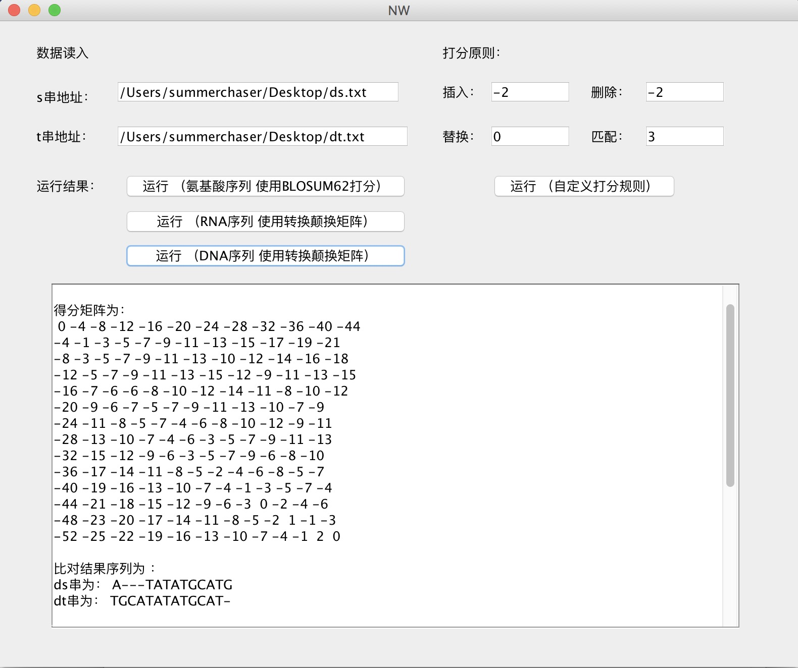

# Needleman-Wunsch
生物信息     Needleman-Wunsch序列比对算法  
  
Needleman-Wunsch算法可进行序列全局最优比对  
  
## 基本思想： 
要从一个序列变成另一个序列有三种编辑操作，增加，删除，替换（相等也可认为是一种替换），不同编辑操作的代价cost或得分score不同。  
可用得分函数来评价编辑操作。  
如：  
S (a, a) = 1  
S (a, b) = 0   a ！= b	  
S (a, -) = S ( -, b) = -1   
  
Needleman-Wunsch算法是一种基于得分思想的编辑距离方法，从两个序列所有可能的比对中，挑选得分最大的最优比对作为结果。  
  
假如已知序列0:s:i 和0:t:j 所有较短子序列的最优比对    
即已知：    
	（1）0:s:(i-1)  和 0:t:(j-1) 的最优比对     
	（2） 0:s:(i-1) 和 0:t:j  的最优比对    
	（3） 0:s:i  和 0:t:(j-1) 的最优比对    
   
则0:s:i和 0:t:j 的最优比对一定是上述三种情况之一的扩展    
（1）替换（si，tj）或匹配（si，tj ) ，这取决于si 是否等于tj   
（2）删除（si， -）；  
（3）插入（ -，tj ）    

Needleman算法计算过程：  
从S[0,0]开始，通过状态转移方程逐步计算S[i,j]，并保存推进的路径。  
   
最优路径求解：    
从S[m,n]开始，反向前推。 
假设在反推时到达到S[i,j]，根据保存的计算路径判断Si , j究竟是根据S[i-1,j],S[i-1,j-1]和S[i,j-1]中的那一个计算而得到的。     
找到这个点以后，再从此点出发，一直到S[0,0]为止。      
走过的这条路径就是最优路径（即得分最大路径），其对应于两个序列的最优比对。     

         

## 软件截图

